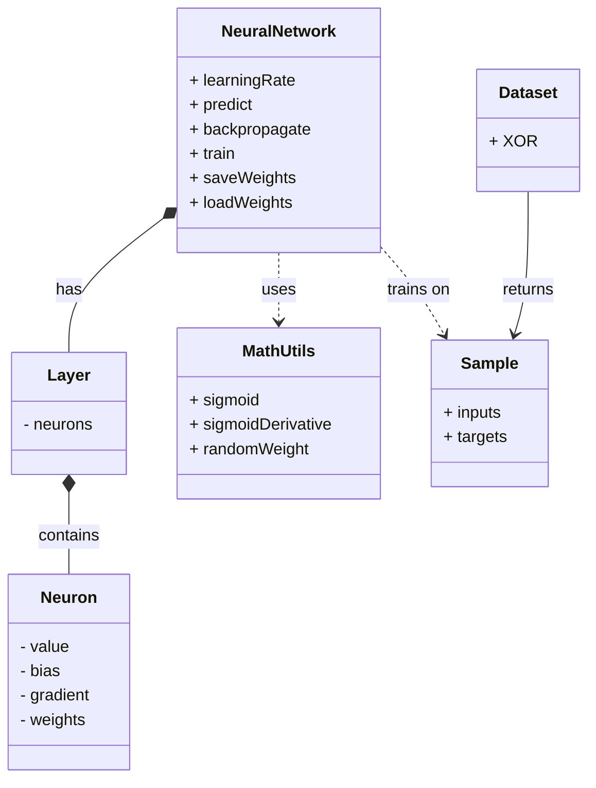

# NeuralNet++   

A simple, object-oriented feed-forward neural network engine in C++.  
It demonstrates OOP composition, memory management, backpropagation, and a classic XOR demo.  

## 🚀 Features  
- **Clean OOP design**: `NeuralNetwork` → `Layer` → `Neuron`.  
- **Training**: Backpropagation with sigmoid activation and mean squared error.  
- **Persistence**: Save and load weights/biases in a custom text format.  
- **Interactive CLI**: Menu-driven training, testing, and custom predictions.  
- **Demo mode**: Fast XOR dataset training and evaluation.  

## ⚙️ MathUtils  
Utility class providing core mathematical functions used by the network.  

### Functions  
- `sigmoid(x)`  
  Returns 1 / (1 + exp(-x)), squashing any real number to (0,1).  
- `sigmoidDerivative(sigmoidOutput)`  
  Calculates derivative as `sigmoidOutput * (1 - sigmoidOutput)`.  
- `randomWeight()`  
  Generates a random double between -1.0 and 1.0 using `mt19937`.  

```cpp
double x = 0.5;
double y = MathUtils::sigmoid(x);            // 0.622459
double grad = MathUtils::sigmoidDerivative(y);
double w = MathUtils::randomWeight();        // e.g., -0.345672
```  

## 🔢 Sample  
Simple struct representing one training example.  
- `inputs`: vector of input values.  
- `targets`: vector of expected outputs.  

```cpp
struct Sample {
  vector<double> inputs;
  vector<double> targets;
};
```  

## 🧠 Neuron & Layer  

### Neuron  
Represents a single node.  
- `value`: current activation.  
- `bias`: bias term (random-initialized).  
- `gradient`: error gradient for backprop.  
- `weights`: outgoing weights to next layer.  

```cpp
Neuron n(numOutputs, hasBias);
n.value    = 0.0;
n.bias     = randomWeight();
n.weights  = vector<double>(numOutputs);
```  

### Layer  
Holds a collection of neurons at the same depth.  
- Constructs each neuron with `numOutputs` weights.  
- Input-layer neurons have no bias or outgoing weights.  

```cpp
Layer(int numNeurons, int numOutputs, bool isInputLayer = false) {
  for (int i = 0; i < numNeurons; i++)
    neurons.emplace_back(numOutputs, !isInputLayer);
}
```  

## 🏗️ Architecture  

Short class relationship overview.  



## 🔄 NeuralNetwork  

Core engine managing layers, forward pass, backpropagation, and I/O.  

### Forward Pass  
1. Assign input values to the first layer.  
2. For each subsequent layer:  
   - Sum `bias` + weighted outputs from previous layer.  
   - Apply `sigmoid` to compute activation.  
3. Return output-layer activations.  

```cpp
vector<double> predict(const vector<double>& inputs) {
  layers[0].neurons[i].value = inputs[i];
  for (L = 1; L < layers.size(); L++) {
    double sum = bias;
    sum += prevLayer.neurons[i].value * prevLayer.neurons[i].weights[j];
    currLayer.neurons[j].value = MathUtils::sigmoid(sum);
  }
  return outputs;
}
```  

### Backpropagation  
1. **Output gradients**: `(target - output) * sigmoidDerivative(output)`.  
2. **Hidden gradients**: weighted sum of next-layer gradients × derivative.  
3. **Weight update**:  
   - `Δweight = learningRate * gradient_next * value_curr`.  
   - `bias += learningRate * gradient`.  

```cpp
// Compute output layer gradients
double error = targets[i] - output;
n.gradient = error * sigmoidDerivative(output);
// Propagate to hidden layers
errorSum += curr.weights[j] * nextLayer.neurons[j].gradient;
curr.gradient = errorSum * sigmoidDerivative(curr.value);
// Update weights & biases
w += learningRate * nextGradient * currValue;
bias += learningRate * nextGradient;
```  

### Training Loop  
- Iterates over epochs and samples.  
- Predicts, computes loss, backpropagates per sample.  
- Optionally reports average loss every 10% of epochs.  

```cpp
for (int epoch = 1; epoch <= epochs; epoch++) {
  for (auto& sample : data) {
    auto out = predict(sample.inputs);
    totalLoss += computeLoss(out, sample.targets);
    backpropagate(sample.targets);
  }
  // report every epochs/10
}
```  

## 💾 Persistence (Save/Load)  
Allows weight reuse across runs.  

- **File format**:  
  1. Number of layers  
  2. Neuron counts per layer  
  3. For each neuron: `bias w0 w1 ...`  

- **Save**:  
  ```cpp
  net.saveWeights("weights.txt");
  ```
- **Load**:  
  ```cpp
  net.loadWeights("weights.txt");
  ```  

## 🖥️ CLI Interface  

Interactive menu guiding training, testing, and I/O.  

```bash
./neuralnet
```

### Menu Options  
- **1. Train network on XOR**  
- **2. Test current network**  
- **3. Predict custom input**  
- **4. Save weights to file**  
- **5. Load weights from file**  
- **6. Run full demo**  
- **0. Exit**  

### Full Demo Mode  
Quickly trains and tests a `2 → 3 → 1` network on the XOR dataset.  

```bash
./neuralnet demo
```  

## 🛠️ Compilation & Running  
- Compile with **C++17**:  
  ```bash
  g++ -std=c++17 main.cpp -o neuralnet
  clang++ -std=c++17 main.cpp -o neuralnet
  ```  
- Run interactive mode:  
  ```bash
  ./neuralnet
  ```  
- Run XOR demo:  
  ```bash
  ./neuralnet demo
  ```  

## 🤔 Future Improvements  
- Support custom topology via CLI.  
- Add alternative activation functions (ReLU, Tanh).  
- Load datasets from CSV files.  
- Visualize loss curve in real time.  

—  
**Author**  
Zamad Shakeel • BS AI Student, UCP Lahore
